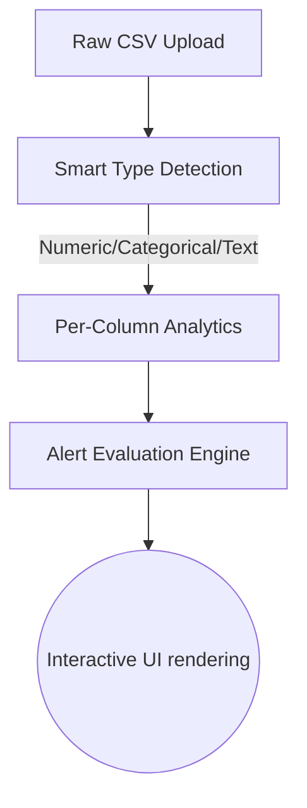

<h1 align="center">🚀 AUTOMATIC EDA</h1>

<p align="center">
  <b>An automated, intelligent Exploratory Data Analysis tool built with Streamlit.</b><br>
  <i>Extract meaningful insights from any CSV dataset — instantly.</i>
</p>


---

## 📌 Project Overview
**AUTOMATIC EDA** is a blazing-fast dashboard built entirely in Python. It's designed to replicate and modernize the core functionality of tools like `ydata-profiling` inside a sleek, intuitive Streamlit web interface. 

The complete workflow covers:
- **🗂 Automatic Column Type Detection**
- **📊 Deep Statistical Profiling**
- **🧮 Interactive Correlation Analysis**
- **🔍 Missing Value Detection** 

All without writing a single line of Python code!

---

## ⚡ Analytical Features

| Feature | Description |
|---|---|
| 🏠 **Overview Room** | Bird's-eye view of your dataset. See rows, variables, duplicate row counts, and memory size at a glance. |
| 🚨 **Smart Alerts** | Automatically flags missing values, uniform columns, all-zero columns, and highly correlated variables (Threshold > 0.5). |
| 📊 **Variable Profiling**| Per-column detailed dive. Generates histograms for numerics, bar charts for categorical formats, and word clouds for text data. |
| 🪢 **Interactions** | Dynamic Scatter plot interface to visually inspect the relationship between any two numerical features. |
| 🎯 **Correlations** | Auto-encodes categorical data safely to render beautiful, fully-readable Heatmaps and Correlation tables. |
| 🧩 **Missing Values** | Comprehensive missing data viz via Count Bar Charts, Nullity Matrices, and Nullity Heatmaps using the `missingno` library. |

---

## 🧱 Workflow Architecture



---

## 🚀 Quickstart Guide

### 1. Requirements

Before running the app locally, ensure you have Python 3.8+ deployed on your system.
```bash
# Clone this repository
git clone https://github.com/GaurRitika/Automatic-EDA_platform-
cd Auto-EDA

# Install the dependencies
pip install -r requirements.txt
```

### 2. Run the App

```bash
# Start your local Streamlit server
streamlit run app.py
```

### 3. Usage

1. **Upload Dataset:** Drag and drop any tabular `.csv` file into the sidebar.
2. **Navigate:** Use the sidebar radio buttons to switch between Views.
3. **Analyze:** Let the interface compute everything from memory usage to data outliers in real-time.

---


